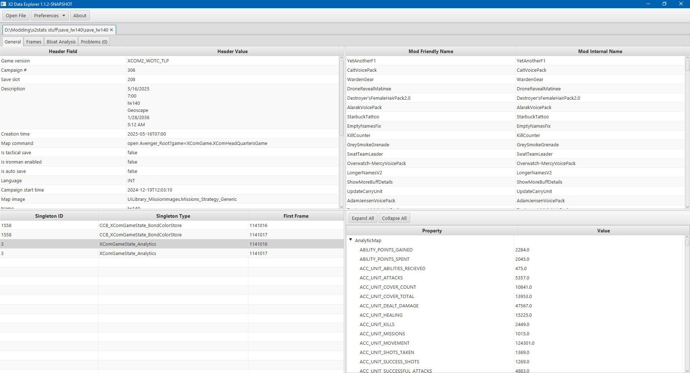
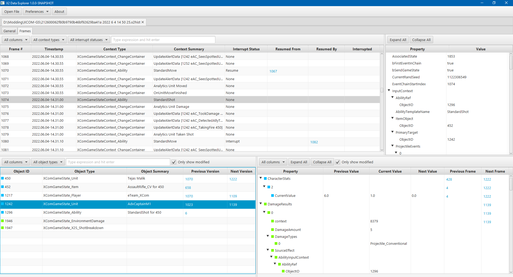
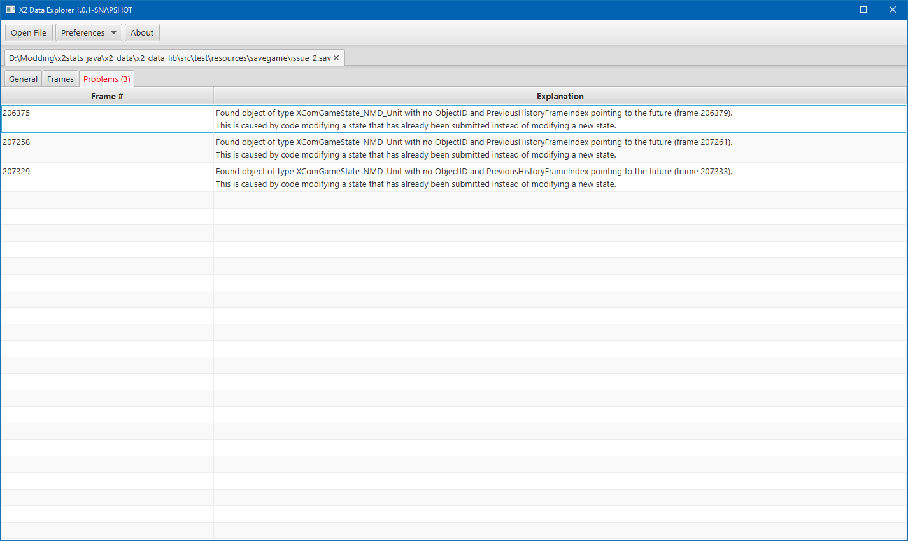
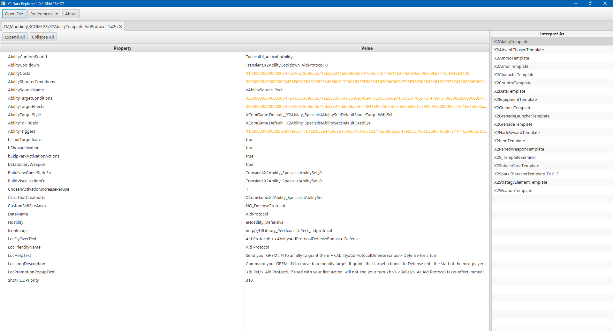

= X2 Data Explorer User Guide

To get started with X2 Data Explorer, download the latest release from the releases page on GitHub. Unzip it somewhere and run `X2 Data Explorer.exe`.

NOTE: This guide assumes you are familiar with how XCOM 2's https://www.reddit.com/r/xcom2mods/wiki/index/game_states/[game state system] works.

NOTE: Windows x64 is the only officially supported platform. X2DE may work on other platforms, but that has not been tested.

Now you need to open a file. You can do this by clicking the `Open File` button at the top left of the screen, or by dragging and dropping files onto the application. X2DE can load:

* <<hist-files>>
* <<bso-files>>

Multiple files can be loaded at the same time. Each file will be in a separate tab.

[#hist-files]
== Save and History Files

Save files are produced when you save a regular game. History files are produced when you save a ladder game. Save and history files have the same format and work the same way, except that save files have an additional header with some extra information. Both file types contain the entire game state history since the last time the history was archived (which occurs during each map transition).

After loading one of these files, the tab will contain three sub-tabs: the <<general-tab>>, the <<frames-tab>>, and the <<problems-tab>>.

[#general-tab]
=== General Tab

For a save file, the General tab contains four sections:

* Top left: information from the save file header. This can tell you things like: when the save file was created, whether it was created in tactical or strategy, and which version of the game created it.
* Top right: a list of mods and DLCs that were active when the save was created.
* Bottom left: a list of singleton XComGameStateObjects. Singleton objects are objects whose class has `bSingletonStateType` set to true. Historical versions of these objects are not serialized, so unlike other objects, there is no way to know what a singleton object looked like at each frame in the history. Fortunately, singleton objects are very rare. XComGameState_Analytics is the only such class in the base game.
* Bottom right: the object properties tree, populated when you click on any singleton object.

For a history file, the General tab is mostly the same, except the list of mods and DLCs is removed, and the header information only contains a few fields that are available from XComGameStateHistory.

[#frames-tab]
=== Frames Tab

The Frames tab shows the entire game state history since the last time the history was archived. It's divided into four sections.

* Top left: the list of XComGameStates, also known as history frames. Clicking one of these will populate the sections below and to the right.
* Top right: the XComGameStateContext property tree for the selected frame.
* Bottom left: the list of XComGameState_BaseObjects that exist in the selected frame. Clicking one of these will populate the section to the right.
* Bottom right: the XComGameState_BaseObject property tree for the selected object.

By default, all columns are shown in each table. You may wish to hide some of them to make more space, which you can do by clicking the `All Columns` dropdown and clicking on columns you want to hide. You can also drag and drop the columns to change their order.

NOTE: Hiding columns and changing their order in this way is temporary and will not be remembered if you load a different file. To change the default settings, use the General settings dialog, accessible from the Preferences menu at the top of the screen.

Some columns support easy copying of their contents. Just right-click the table cell and click Copy to Clipboard.

The frames and objects tables also support several filters to help you find information you're looking for. You can easily look for specific object or context types, as well as specific interrupt statuses.

In the object and object properties tables, you can also toggle whether to show all objects/properties, or only objects/properties that were modified in the currently selected frame. The modification type is indicated by a small colored square in front of the Object ID or Property name:

* Green: this object/property was added in the selected frame.
* Red: this object/property was removed in the selected frame.
* Blue: this object/property's value changed in the selected frame.
* Grey: this object/property's value was not modified in the selected frame.

[#problems-tab]
=== Problems Tab

The Problems tab shows a list of problems detected in the file. The number on the tab indicates the number of problems found. If any problems were found, the tab's text will be red to draw attention to it.

It's easy for modders to make mistakes when writing code. Often, these mistakes are subtle and hard to detect. The Problems tab helps to highlight such mistakes so they can be fixed.

==== Advanced Filtering

For more advanced filtering, you can type a Groovy expression and hit enter. The background of the expression box indicates the current state of the expression:

* Blue: the expression has been changed since the last time it was applied.
* Green: the expression is syntactically correct and has been applied.
* Red: the expression is syntactically incorrect and has not been applied.

IMPORTANT: An expression that is correct _syntactically_ can still be incorrect _semantically_. If your search doesn't return what you expected, check your expression to make sure it's doing what you think it's doing.

For expressions on frames, `f` is the candidate frame. It is a `com.github.rcd47.x2data.explorer.file.HistoryFrame`. For expressions on objects, `o` is a candidate object as it exists in the selected frame. It is a `com.github.rcd47.x2data.explorer.file.GameStateObject`.

For a given frame or object to match the expression, the expression must return a result that is https://groovy-lang.org/semantics.html#the-groovy-truth[truthy as defined by Groovy]. This means that the result does not have to be a boolean. E.g. to find any object that contains a `m_template` field, you could simply search for `o.m_template`.

IMPORTANT: When writing expressions to filter on fields within a game state object, remember that each field in the tree is a `com.github.rcd47.x2data.explorer.file.GameStateObjectField`, and the value must be accessed explicitly. E.g. to find a soldier whose first name is Ben, your filter would need to be `o.strFirstName.value == 'Ben'`, not just `o.strFirstName == 'Ben'`.

IMPORTANT: When writing expressions to match fields that are Unreal names, remember that the name is a `com.github.rcd47.x2data.lib.unreal.mappings.UnrealName`, and the value must be accessed through the `original` or `normalized` fields. E.g. to find the eastern US region, your filter would need to be `o.m_TemplateName.value.original == 'WorldRegion_EastNA'`, not just `o.m_TemplateName.value == 'WorldRegion_EastNA'`.

==== Context and Object Summaries

The frames and objects tables have a summary column that provides a short description of what that frame or object is about. The summaries are powered by Groovy scripts. Default scripts are included in the application, but can be modified if you like. In the Preferences menu at the top of the screen, click the State Object Summary Script or Context Summary Script menu items to edit the scripts.

[#bso-files]
== BasicSaveObject Files

BSO files are produced by `class'Engine'.static.BasicSaveObject()`. They're very simple. They only contain the primitive fields and structs in an object. Any references to other objects are lost during serialization.

The file itself doesn't contain anything that indicates what kind of object it is, so X2DE uses a filename convention to determine the type. BSO filenames should start with the name of the object's class, then a space, then any other information that helps to identify the file. E.g. `X2AbilityTemplate AidProtocol.x2o`. If the filename doesn't follow this convention or uses the wrong class, you can click a different type in the Interpret As list on the right to re-parse the file using different mappings.

== Unparseable Data

Due to quirks in the file formats, link:../../x2-data-lib/docs/mappings.adoc[mappings] sometimes need to be defined before certain fields can be parsed. When X2DE cannot parse a field's value, the value will be shown as an orange-colored hex dump.